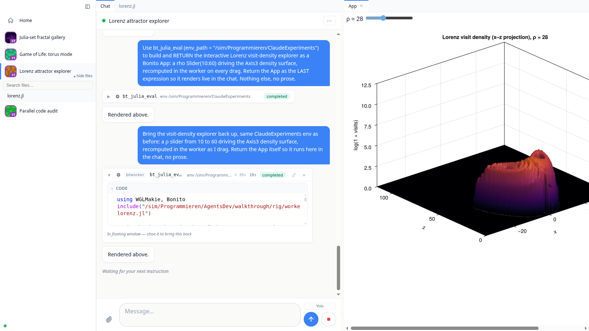

<p align="center">
  <picture>
    <source media="(prefers-color-scheme: dark)" srcset="BonitoAgents/assets/logo/bonitoagents-dark.svg">
    
  </picture>
</p>

<h1 align="center">BonitoAgents</h1>

<p align="center">
  A self-hosted workspace where coding agents run Julia, return live apps,<br>
  and work across every machine you own.
</p>

<p align="center">
  <a href="https://agents.bonito.sh/"><strong>Documentation</strong></a>
</p>

> [!WARNING]
> Use at your own risk: there are no safeguards (yet) preventing an LLM driven
> through BonitoAgents from wiping your entire PC or leaking all your secrets.

BonitoAgents turns an agent conversation into a visual development workspace.
The agent can evaluate code in a persistent Julia session, show returned values
through Julia's MIME display system, mount interactive Bonito apps, open the
artifacts it creates, and put its git diff in front of you for line-level
feedback. A worker on each machine keeps the agent, code and computation
together; one dashboard gives you the live result from any browser.

<p align="center">
  
</p>

## What you can do

### Run Julia here or on another worker, and see the actual result

`bt_julia_eval` gives every project a persistent Julia session. Packages,
variables and compiled methods stay warm between calls, stdout streams while
the code runs, and Revise picks up source edits. Returned values use Julia's
MIME display system, so plots, images, HTML and other rich results render in the
conversation instead of being flattened into terminal text.

Pass `worker = "desktop"` to any eval-family tool to run the same code on
another connected machine. The output still streams into the current chat and
the result still renders there. `bt_sync_folder` moves the required code and
data first, with subsequent syncs sending only what changed. This makes it
practical to keep the conversation on a laptop while running the computation
beside a dataset, a GPU or a long-lived project environment elsewhere.

### Put a working Bonito app inside the conversation

A Bonito `App` or WGLMakie figure returned from `bt_julia_eval` is mounted as a
live value. Slider moves and button clicks travel back to the Julia object in
the worker, so an agent can build an interface, run it in the transcript, and
iterate on it with you. Detach the app into a tab or floating window, dock it
beside the chat and its source file, and it stays interactive.

<p align="center">
  
</p>

### Inspect what the agent creates

The agent can put a worker-side file into the chat with `bt_show`, and you can
open the same file from the project tree as a workspace tab. Both routes use
the same renderers: markdown, images, video and audio, sortable CSVs, notebooks
with their outputs, interactive 3D geometry, PDF and HTML, source in Monaco,
and a hex view for opaque bytes. Text-backed formats can switch between preview
and source and save directly to the worker.

The result is a useful loop for work that produces more than source code: ask
for an analysis, simulation, visualization, report or small interface, inspect
the real artifact in place, then continue the conversation with that result in
view.

### Review the git diff with the agent

**Review changes** opens the project's git diff, including newly created files.
Comment on one line or a selected block: **Ask** sends that question into the
chat immediately with its code context, while **Feedback** collects several
comments into one numbered instruction. The review can compare the working
tree with any branch, tag or commit.

<p align="center">
  
</p>

### Let BonitoAgents debug and improve itself

**Debug BonitoAgents** opens an agent chat on a BonitoAgents source checkout on
the worker you choose. In dev mode that chat also gets tools for inspecting the
running system: server and worker state, projects, chats, eval bridges, logs
from every machine, memory use and registry growth. It can reproduce a problem
through the live server controls, trace it into the source, edit the checkout
and run the tests. Restart that worker and it runs the edited code. The same
agent workspace is therefore also the environment for diagnosing and improving
BonitoAgents itself.

### Control every machine from one dashboard

A small worker process runs on every machine that has code or compute on it.
All workers connect out to one dashboard server, and you control their agent
sessions from a single web UI, including from your phone. Nothing runs in a
BonitoAgents cloud; agents work directly on your checkouts with your own agent
subscription.

```
   browser / phone ──HTTP/WS──▶  dashboard server (Bonito web app)
                                      ▲  ▲
                     control WS +     │  │
                     file transfer    │  │
                          ┌───────────┘  └───────────┐
                     worker (laptop)             worker (desktop)
                     ├─ claude-code agent (ACP)  ├─ agent per project
                     ├─ persistent Julia MCP     ├─ …
                     └─ your project checkouts   └─ your project checkouts
```

Agents are pluggable [ACP](https://agentclientprotocol.com) providers:
Claude Code by default, with MiMo, OpenCode, Kimi Code and Codex adapters
included ([`AgentProviders/`](AgentProviders/)).

Chats persist on disk, existing Claude Code sessions can be imported with their
history, and browser reconnects resume where you left off. Heartbeats detect
and heal dropped or half-open worker connections after suspend or a network
switch. The complete inventory lives in [`FEATURES.md`](FEATURES.md).

## Quick start

### Install (Linux / macOS)

```bash
curl -fsSL https://agents.bonito.sh/install.sh | sh
```

### Install (Windows, PowerShell)

```powershell
irm https://agents.bonito.sh/install.ps1 | iex
```

This downloads the prebuilt bundle for your machine (a self-contained Julia +
BonitoAgents, no separate Julia install needed), puts a `bonito-agents` command
on your PATH, and immediately starts the desktop app: a local dashboard server
plus a worker for this machine, opened in your browser. Everything runs on your
box; nothing is sent to a cloud.

Afterwards, start it any time with:

```bash
bonito-agents
```

Re-run the same install line to **auto-update** to the newest release (it skips
the download when you are already current). State persists across restarts and
updates under the platform data dir (`~/.local/share/BonitoAgents` on Linux,
`~/Library/Application Support/BonitoAgents` on macOS,
`%LOCALAPPDATA%\BonitoAgents` on Windows) and is never touched by updates.
Useful flags: `bonito-agents --port=8038`, `--no-window`, `--data-dir=PATH`;
`… | sh -s -- --no-run` to install without starting, `--uninstall` to remove
(the raw bundles are also attached to
[releases](https://github.com/SimonDanisch/BonitoAgents.jl/releases)).

For Claude Code agents you also need Node 20+,
`npm install -g @anthropic-ai/claude-code @agentclientprotocol/claude-agent-acp`,
and a logged-in `claude`.

### From source

```bash
git clone https://github.com/SimonDanisch/BonitoAgents.jl
cd BonitoAgents.jl
julia --project=BonitoAgentsApp -e 'using Pkg; Pkg.instantiate()'
julia --project=BonitoAgentsApp -m BonitoAgentsApp
```

Requires [Julia](https://julialang.org/install/) 1.12+. Same result as the
installer: dashboard server + local worker + UI in your browser.

### One server, many machines

Run the server somewhere always reachable. With the installer above it is just
the `server` mode of the same command:

```bash
bonito-agents server --host=0.0.0.0 --port=8038
```

(from a source checkout:
`julia --project=BonitoAgentsApp -m BonitoAgentsApp server --host=0.0.0.0 --port=8038`)
or install it as a systemd service with
[`BonitoAgents/assets/install_server.sh`](BonitoAgents/assets/install_server.sh).
Then, on each machine that should run agents, paste the one-liner from the
dashboard's home screen:

```bash
curl -fsSL http://<your-server>:8038/install.sh | sh
```

It installs the worker pinned to the server's code revision, registers the
machine under a stable identity, and sets up a systemd user service on
Linux. Re-run it any time to update.

## Tour

Two recorded tours are embedded on the
[documentation home page](https://agents.bonito.sh/): the multi-project
dashboard, and a single thread followed end to end, from a streaming
`bt_julia_eval` to the interactive Lorenz app the agent built, docked beside its
source file. Both are real agent sessions, replayed on camera by
[`examples/walkthrough_dashboard.jl`](examples/walkthrough_dashboard.jl) and
[`examples/walkthrough.jl`](examples/walkthrough.jl). If you want to record one
without an API key,
[`examples/walkthrough_mock.jl`](examples/walkthrough_mock.jl) tells the same
story against a deterministic mock agent.

## Documentation

Getting started, concepts, deployment and API docs are at
[agents.bonito.sh](https://agents.bonito.sh/), and their source is
[`docs/`](docs/):

```bash
julia --project=docs -e 'using Pkg; Pkg.instantiate()'
julia --project=docs docs/make.jl
julia --project=docs docs/run.jl        # serve the built site locally
```

## Development

```bash
julia --project=BonitoAgents -e 'using BonitoAgents; BonitoAgents.wait!(dev_server(auto_open = true))'
```

`dev_server()` boots the same stack against throwaway tempdirs. The test
suite drives it through headless Electron:

```bash
julia --project=BonitoAgents -e 'using Pkg; Pkg.test("BonitoAgents")'                          # everything
julia --project=BonitoAgents -e 'using Pkg; Pkg.test("BonitoAgents"; test_args=["unit"])'      # fast, no browser
julia --project=BonitoAgents -e 'using Pkg; Pkg.test("BonitoAgents"; test_args=["e2e:media"])' # one suite
```

## Security model

Workers authenticate to the server with a shared secret from the install
one-liner. The dashboard has no user accounts, so keep it on localhost, a
VPN, or behind reverse-proxy auth. Agents run with the permissions of the
worker process; the chat's permission prompts and the Yolo toggle decide how
much they may do unattended.
