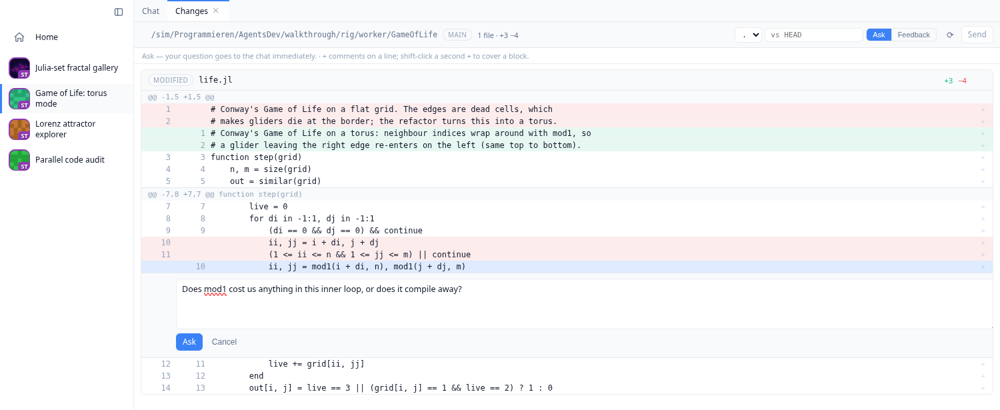

# BonitoAgents

BonitoAgents turns an agent conversation into a visual development workspace.
The agent can run code in a persistent Julia session, return rich values and
interactive Bonito apps directly into the chat, show the files it creates, and
put its git diff in front of you for line-level review. Workers keep the agent,
code and computation together on your own machines; one dashboard gives you
the live result from your desk or your phone.

!!! warning
    Use at your own risk: there are no safeguards (yet) preventing an LLM
    driven through BonitoAgents from wiping your entire PC or leaking all your
    secrets.

## One dashboard for the whole workflow

Every chat on every machine is a live card, carrying a picture from the chat's
own work once it has shown one. Switch between projects from the cards or the
sidebar, answer permission prompts from another device, and keep long-running
work beside the code and hardware it needs.

```@raw html
<video src="assets/dashboard.mp4" controls autoplay muted loop playsinline
       style="width: 100%; border-radius: 10px; border: 1px solid rgba(128,128,128,0.25);">
</video>
```

Every chat in that video is a real agent session. The next video follows one
thread end to end: stdout from `bt_julia_eval` streams line by line, Julia sets
render into a gallery, a Game-of-Life refactor opens as a reviewable diff, and
three subagents review a file in parallel. It ends with the Lorenz explorer the
agent built: a live app in the transcript whose slider recomputes the density
surface on the worker, then detaches beside the chat and `lorenz.jl` while it
keeps running.

```@raw html
<video src="assets/walkthrough.mp4" controls autoplay muted loop playsinline
       style="width: 100%; border-radius: 10px; border: 1px solid rgba(128,128,128,0.25);">
</video>
```

## Run Julia here or on another worker, and see the actual result

`bt_julia_eval` is a persistent Julia session per project. Packages, variables
and compiled methods stay warm between calls, stdout streams while code runs,
and Revise picks up source edits. Returned values go through Julia's MIME
display system, so plots, images and HTML render in the conversation. A Bonito
`App` or WGLMakie figure stays live: sliders and buttons round trip to the Julia
object on the worker. Detach it into a tab or floating window and dock it beside
the chat and source file without killing the session.

Every eval-family tool also accepts `worker = "name"`. Run code on another
connected machine while its output and rich result remain in the current chat;
use `bt_sync_folder` to send the code and data first. A laptop conversation can
therefore drive a warm environment, dataset or GPU on another worker without
moving the whole agent session.

Read [Julia Tools & Live Apps](@ref) for the eval lifecycle, remote workers,
output limits and live-value bridge.

## Inspect every artifact in place

`bt_show` puts a file from the worker directly into the conversation. The same
file can open from the project tree as a workspace tab. Both routes render
markdown, images, video and audio, sortable CSVs, notebooks with their outputs,
interactive 3D geometry, PDF and HTML, source in Monaco, and opaque bytes as a
hex dump. Text-backed files switch between preview and source and save back to
the worker.

This supports a complete loop for analyses, simulations, visualizations,
reports and small interfaces: ask the agent to create the result, inspect the
real artifact beside the conversation, then refine it without switching tools.

## Review the agent's changes

**Review changes** opens the project's git diff, including new files, as a
workspace tab. Comment on a line or block and send the question immediately
with **Ask**, or collect several comments with **Feedback** and hand them to the
agent as one numbered instruction. Compare the working tree with any branch,
tag or commit.



## Let BonitoAgents debug and improve itself

**Debug BonitoAgents** opens a chat on a BonitoAgents source checkout on the
worker you select. Dev mode gives that agent tools to inspect the live system:
server and worker state, projects, chats, eval bridges, logs from every machine,
memory use and registry growth. The agent can reproduce a problem through the
live server controls, trace it into the source, edit the checkout, and run the
tests. Restart that worker and it runs the edited code. BonitoAgents' own
development and diagnosis happen through the same workspace it provides for
other projects.

See [Debugging BonitoAgents itself](@ref) for how the checkout and live-process
tools work.

## Keep the session alive

Chats persist on disk and reconnect where you left off. Existing Claude Code
sessions on a worker can be imported with their history. Heartbeats on both
ends detect half-open links after suspend or a network switch and reconnect the
worker. Agent turns stream as CommonMark, expandable tool calls, terminal
output, images, plans, todos and subagent activity; the workspace arranges
chats, editors and live apps into tabs, splits and floating windows.

## Where next

- [Getting Started](@ref): running everything on one machine, then adding more
  with a copy-paste one-liner.
- [Concepts](@ref): how server, workers, projects and agents fit together.
- [The Chat](@ref): what the transcript and workspace can do.
- [Julia Tools & Live Apps](@ref): `bt_julia_eval`, a shared live REPL whose
  results embed as interactive apps, remote execution, plus `bt_show`.
- [Development](@ref): tests, walkthroughs, and the dev mode that lets an agent
  inspect and improve the running BonitoAgents system.
